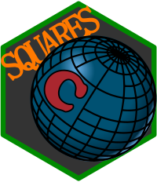

```{r, include = FALSE}
knitr::opts_chunk$set(
  collapse = TRUE,
  comment = "#>",
  fig.path = "man/figures/README-",
  out.width = "100%",
  dev = "ggsave",
  fig.ext = "png"
)
library(ggplot2)
library(sf)
theme_set(theme_light())

```

# csquares

<!-- badges: start -->
[](https://github.com/pepijn-devries/csquares/actions/workflows/R-CMD-check.yaml)

[](https://CRAN.R-project.org/package=csquares)
[](https://cran.r-project.org/web/checks/check_results_csquares.html)
[](https://pepijn-devries.r-universe.dev/csquares)
[](https://app.codecov.io/gh/pepijn-devries/csquares)
<!-- badges: end -->



The Concise Spatial QUery And REpresentation System (c-squares) are identifiers that
correspond with cells in a global grid. The system was developed by
[CSIRO Oceans & Atmosphere](https://en.wikipedia.org/wiki/CSIRO_Oceans_and_Atmosphere) and
divides the globe in rectangles of 10 by 10 degrees (longitude and latitude in
WGS84). It is a hierarchical system, meaning that higher resolutions are also supported,
as long as its cell size is a tenfold of 1 or 5 degrees (i.e., cells can have the following
sizes in degrees: 10, 5, 1, 0.5, 0.1, etc.).

The c-squares format is a well defined exchange format for spatial raster data, it allows
for light-weight text querying / aggregation and expansion to different resolutions. The
csquare R package facilitates the translation of c-square code into spatial information
([sf](https://r-spatial.github.io/sf/) and [stars](https://r-spatial.github.io/stars/))
and vice versa.

For more technical information on c-squares, please consult the
[Wikipedia page](https://en.wikipedia.org/wiki/C-squares) or the
[CSIRO c-squares page](https://www.cmar.csiro.au/csquares/).

## Installation

> Get CRAN version
```{r eval=FALSE}
install.packages("csquares")
```

> Get development version from r-universe
```{r eval=FALSE}
install.packages("csquares", repos = c("https://pepijn-devries.r-universe.dev", "https://cloud.r-project.org"))
```

## Example

The example below is based on killer whale realm data extracted from the publication by
[Costello et al. (2017)](#references).

The `orca` data set itself is *not* provided as a [simple features](https://r-spatial.github.io/sf/)
object, which is commonly used in R for spatial analyses. Instead, spatial information is encoded in
the c-squares format. The example below shows how these codes can be decoded in a spatially explicit
format which can be used for subsequent analyses.

```{r orca, message=FALSE}
library(csquares)
library(sf)
library(ggplot2)

## Convert the data.frame into a csquares object
orca_csq <- as_csquares(orca, csquares = "csquares")

## Convert the csquares object into a simple features object
## and transform to Robinson's projection
orca_sf <-
  orca_csq |>
  st_as_sf() |>
  st_transform(crs = "+proj=robin +lon_0=0 +x_0=0 +y_0=0")

## Make a plot of the spatial data
ggplot(orca_sf) +
  geom_sf(aes(fill = orcinus_orca)) +
  coord_sf(expand = FALSE)
```

The example above uses existing data with specified c-square codes. You can also
create a raster with c-square codes from scratch. The example below shows how to
create a 0.1 x 0.1 degrees raster for a specific bounding box.

```{r raster}
st_bbox(c(xmin = 5.0, xmax = 5.5, ymin = 52.5, ymax = 53), crs = 4326) |>
  new_csquares(resolution = 0.1)
```

## References

 * <https://www.cmar.csiro.au/csquares/>
 * <https://en.wikipedia.org/wiki/C-squares>
 * Costello, M.J. (2017); University of Auckland <https://doi.org/10.17608/k6.auckland.5086654>
   Licence [CC BY 4.0](https://creativecommons.org/licenses/by/4.0/)
 * Costello M.J., Tsai P., Wong P.S., Cheung A.K.L, Basher Z. & Chaudhary C. (2017);
   "Marine biogeographic realms and species endemicity" Nature Communications 8, 1057
   <https://doi.org/10.1038/s41467-017-01121-2>
